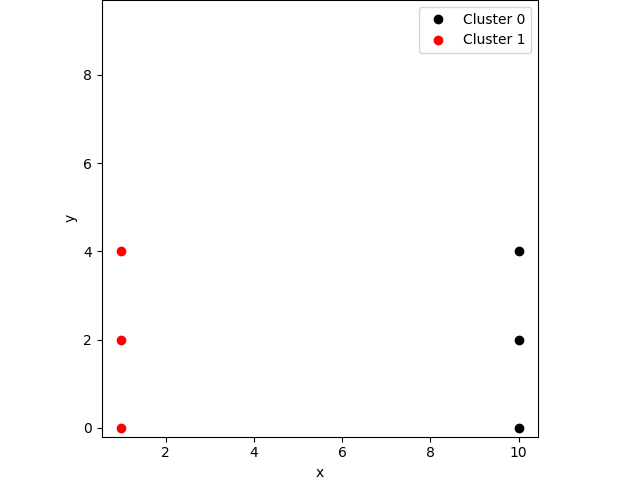
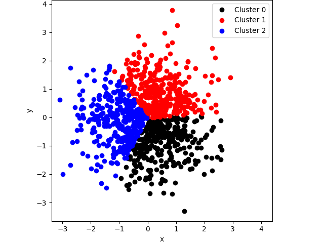

# Example 17: KMeans Clustering

## Contents
* [Overview](#overview) 
* [KMeans Algorithm](#kmeans_algorithm)
* [Include files](#include_files)
* [The main function](#m_func)
* [Results](#results)
* [Source Code](#source_code)


## <a name="overview"></a> Overview

## <a name="kmeans_algorithm"></a> KMeans Algorithm

## <a name="include_files"></a> Include files

```
#include "cubic_engine/base/cubic_engine_types.h"
#include "cubic_engine/ml/unsupervised_learning/serial_kmeans.h"
#include "cubic_engine/ml/unsupervised_learning/utils/kmeans_control.h"
#include "cubic_engine/ml/unsupervised_learning/utils/cluster.h"

#include "kernel/utilities/data_set_loaders.h"
#include "kernel/maths/lp_metric.h"
#include "kernel/maths/matrix_utilities.h"

#include <random>
#include <iostream>
```

```
namespace example
{

using cengine::uint_t;
using cengine::real_t;
using cengine::DynMat;
using cengine::DynVec;
using cengine::Cluster;

void simple_example(){

    typedef DynVec<real_t> point_t;
    DynMat<real_t> data = kernel::load_kmeans_test_data();

    cengine::KMeansControl control(2);
    control.set_show_iterations_flag(true);

    cengine::KMeans<Cluster<point_t>> kmeans(control);

    // the metric we use
    kernel::LpMetric<2> l2_norm;

    auto init = [&](const DynMat<real_t>& data, uint_t k, std::vector<point_t>& centroids ){
        kernel::extract_randomly(data, centroids, k, false);
    };

    auto result = kmeans.cluster(data, l2_norm, init);
    std::cout<<result<<std::endl;

    const auto& clusters = kmeans.get_clusters();

    for(auto& cluster : clusters){
        std::cout<<"Cluster id...."<<cluster.id<<std::endl;
        std::cout<<"Cluster size.."<<cluster.points.size()<<std::endl;

        for(uint_t p=0; p<cluster.points.size(); ++p){
            const auto point = kernel::get_row(data, cluster.points[p]);
            std::cout<<point[0]<<","<<point[1]<<std::endl;
        }
    }

    // let's save the clusters for visualization
    kmeans.save("kmeans_simple_example.csv", data);
}

void normal_example(){

    typedef DynVec<real_t> point_t;
    DynMat<real_t> data(1000, 2);

    std::random_device rd;
    std::mt19937 gen(rd());

    // mean = 0, std = 1.0
    std::normal_distribution<real_t> distribution;

    for(uint_t r=0; r<data.rows(); ++r){

        for(uint_t c=0; c<data.columns(); ++c){
            real_t x = distribution(gen);

            data(r,c) = x;
        }
    }


    cengine::KMeansControl control(3);
    control.set_show_iterations_flag(true);

    cengine::KMeans<Cluster<point_t>> kmeans(control);

    // the metric we use
    kernel::LpMetric<2> l2_norm;

    auto init = [&](const DynMat<real_t>& data, uint_t k, std::vector<point_t>& centroids ){
        kernel::extract_randomly(data, centroids, k, false);
    };

    auto result = kmeans.cluster(data, l2_norm, init);
    std::cout<<result<<std::endl;

    const auto& clusters = kmeans.get_clusters();

    for(auto& cluster : clusters){
        std::cout<<"Cluster id...."<<cluster.id<<std::endl;
        std::cout<<"Cluster size.."<<cluster.points.size()<<std::endl;
    }

    // let's save the clusters for visualization
    kmeans.save("kmeans_normal_example.csv", data);
}

}

```

## <a name="m_func"></a> The main function

```
int main(){

    try{

        example::simple_example();
        example::normal_example();

    }
    catch(std::exception& e){

        std::cerr<<e.what()<<std::endl;
    }
    catch(...){

        std::cerr<<"Unknown exception occured"<<std::endl;
    }

    return 0;
}
```

## <a name="results"></a> Results

```
        K-means iteration: 1
                 Residual at teration: 0.349173
        K-means iteration: 2
                 Residual at teration: 0.937267
        K-means iteration: 3
                 Residual at teration: 0.506167
        K-means iteration: 4
                 Residual at teration: 0.274914
        K-means iteration: 5
                 Residual at teration: 0.158352
        K-means iteration: 6
                 Residual at teration: 0.088998
        K-means iteration: 7
                 Residual at teration: 0.035338
        K-means iteration: 8
                 Residual at teration: 0.0377464
        K-means iteration: 9
                 Residual at teration: 0.0242081
        K-means iteration: 10
                 Residual at teration: 0.0148149
        K-means iteration: 11
                 Residual at teration: 0.00799814
        K-means iteration: 12
                 Residual at teration: 0.00940804
        K-means iteration: 13
                 Residual at teration: 0.00331343
        K-means iteration: 14
                 Residual at teration: 0.00516062
        K-means iteration: 15
                 Residual at teration: 0
# iterations:..16
# processors:..1
# threads:.....1
Residual:......0
Tolerance:.....1e-08
Convergence:...Yes
Total time:....0.109164

Cluster id....0
Cluster size..318
Cluster id....1
Cluster size..339
Cluster id....2
Cluster size..343

```





## <a name="source_code"></a> Source Code

<a href="../exe.cpp">exe.cpp</a>
