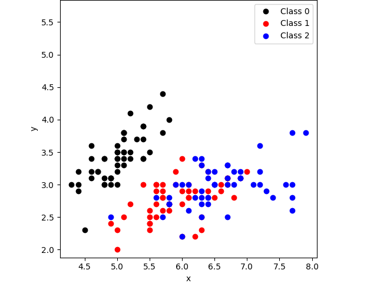

# Example 18: KNN Classification

## Contents
* [Overview](#overview) 
* [KNN Classification](#knn_classification)
* [Include files](#include_files)
* [The main function](#m_func)
* [Results](#results)
* [Source Code](#source_code)


## <a name="overview"></a> Overview



## <a name="knn_classification"></a> KNN Classification

## <a name="include_files"></a> Include files

```
#include "cubic_engine/base/cubic_engine_types.h"
#include "cubic_engine/ml/instance_learning/serial_knn.h"
#include "cubic_engine/ml/instance_learning/utils/knn_control.h"
#include "cubic_engine/ml/instance_learning/utils/knn_classification_policy.h"
#include "cubic_engine/ml/instance_learning/utils/knn_info.h"
#include "kernel/utilities/data_set_loaders.h"
#include "kernel/maths/lp_metric.h"

#include <iostream>
```

## <a name="m_func"></a> The main function

```
int main(){

    using cengine::uint_t;
    using cengine::real_t;
    using cengine::DynMat;
    using cengine::DynVec;
    using cengine::KnnControl;
    using cengine::KnnClassificationPolicy;
    using cengine::Knn;
    using kernel::LpMetric;

    typedef LpMetric<2> similarity_t;
    typedef KnnClassificationPolicy actor_t;

    try{

        auto dataset = kernel::load_iris_data_set(false);

        Knn<DynMat<real_t>, DynVec<real_t>, similarity_t, actor_t> knn(KnnControl(3));
        knn.train(dataset.first, dataset.second);
        auto result = knn.predict(dataset.first);
        std::cout<<result.second<<std::endl;
    }
    catch(std::exception& e){

        std::cerr<<e.what()<<std::endl;
    }
    catch(...){

        std::cerr<<"Unknown exception occured"<<std::endl;
    }

    return 0;
}
```

## <a name="results"></a> Results

```
# threads: 1
# procs: 1
# neighbors: 4
Total runtime: 0.0397838
```


## <a name="source_code"></a> Source Code

<a href="../exe.cpp">exe.cpp</a>
