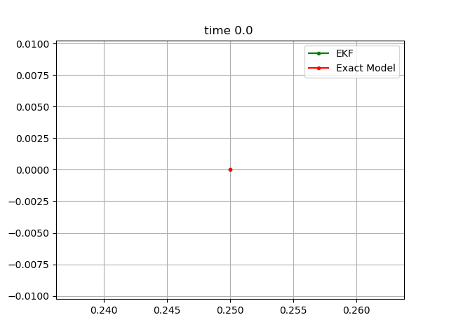

# Example 2: Extended Kalman Filter

## Contents
* [Acknowledgements](#ackw)
* [Overview](#overview) 
    * [Extended Kalman Filter](#ekf)
    * [Motion Model](#motion_model)
    * [Discrete Motion Model](#discrete_motion_model)
* [Include files](#include_files)
* [The main function](#m_func)
* [Results](#results)
* [Source Code](#source_code)


## <a name="overview"></a> Overview

In this example we will develop an Extended Kalaman Filter or EKF for short. In you do not know what an EKF is or how it works have a look at here: 
https://en.wikipedia.org/wiki/Extended_Kalman_filter. Below, we give a brief overview of how the filter works.

### <a name="ekf"></a> Extended Kalman Filter

Briefly, the EKF is an improvement over the classic Kalman Filter that can be applied to non-linear systems. The crux of the algorithm 
remains the predictor-corrector steps as in the Kalman Filter 

In the simulation below, we will assume that the state vector \f$\mathbf{x}\f$ at time \f$t\f$ 
has four components; the 2D position coordinates \f$x,y\f$ the orientation \f$\phi\f$ and the velocity \f$v\f$. This


We will assume that the robot has a speed sensor and a gyro. The input vector therefore becomes  


Also, we assume that the robot has a GNSS sensor. Hence, the robot can observe its \f$x,y\f$ position at each time step.
Therefore, we have the following observation vector.


Both \f$\mathbf{u}\f$ and \f$\mathbf{z}\f$ are subject to sensor noise.  

###<a name="motion_model"></a> Motion Model

The robot motion  model is given by


###<a name="discrete_motion_model"></a> Discrete Motion Model

The discrete motion model becomes


where

where  is the time interval.

The Jacobian matrix is 

Similarly the GPS observation model becomes

where


## <a name="include_files"></a> Include files
The include files, bring into our program scope functionality that our program needs in order to compile and run. 
 
```

#include "cubic_engine/base/cubic_engine_types.h"
#include "cubic_engine/estimation/extended_kalman_filter.h"
#include "kernel/dynamics/diff_drive_dynamics.h"
#include "kernel/base/angle_calculator.h"
#include "kernel/utilities/csv_file_writer.h"
#include "kernel/dynamics/system_state.h"
#include "kernel/maths/constants.h"

#include <cmath>
#include <iostream>
#include <tuple>
```

## <a name="m_func"></a> The main function

Here is the main function that drives the simulation. 


```
namespace example
{

using cengine::uint_t;
using cengine::real_t;
using kernel::dynamics::DiffDriveDynamics;
using cengine::ExtendedKalmanFilter;
using cengine::DynMat;
using cengine::DynVec;
using kernel::dynamics::SysState;


class ObservationModel
{

public:

    typedef  DynVec<real_t> input_t;

    ObservationModel();

    // simply return the state
    const DynVec<real_t> evaluate(const DynVec<real_t>& input)const;

    // get the H or M matrix
    const DynMat<real_t>& get_matrix(const std::string& name)const;

private:

    DynMat<real_t> H;
    DynMat<real_t> M;
};

ObservationModel::ObservationModel()
    :
      H(2,3, 0.0),
      M(2, 2, 0.0)
{
    H(0, 0) = 1.0;
    H(1,1) = 1.0;
    M(0,0) = 1.0;
    M(1, 1) = 1.0;

}

const DynVec<real_t>
ObservationModel::evaluate(const DynVec<real_t>& input)const{
    return input;
}

const DynMat<real_t>&
ObservationModel::get_matrix(const std::string& name)const{
    if(name == "H"){
        return H;
    }
    else if(name == "M"){
        return M;
    }

    throw std::logic_error("Invalid matrix name. Name "+name+ " not found");
}

const DynVec<real_t> get_measurement(const SysState<3>& state){
   return DynVec<real_t>({state.get("X"), state.get("Y")});
}

}

int main() {

    using namespace example;
    uint_t n_steps = 500;

    DiffDriveDynamics exact_motion_model;
    exact_motion_model.set_matrix_update_flag(false);
    DiffDriveDynamics motion_model;

    DynMat<real_t> L(3, 2, 0.0);
    motion_model.set_matrix("L", L);

    DynMat<real_t> F(3, 3, 0.0);
    motion_model.set_matrix("F", F);

    motion_model.set_matrix_update_flag(true);

    ObservationModel observation;

    ExtendedKalmanFilter<DiffDriveDynamics, ObservationModel> ekf(motion_model, observation);

    DynMat<real_t> R(2, 2, 0.0);
    R(0,0) = 1.0;
    R(1, 1) = 1.0;

    DynMat<real_t> Q(2, 2, 0.0);
    Q(0,0) = 0.001;
    Q(1, 1) = 0.001;

    DynMat<real_t> P(3, 3, 0.0);
    P(0, 0) = 1.0;
    P(1, 1) = 1.0;
    P(2, 2) = 1.0;

    ekf.set_matrix("P", P);
    ekf.set_matrix("R", R);
    ekf.set_matrix("Q", Q);


    kernel::CSVWriter writer("state", kernel::CSVWriter::default_delimiter(), true);
    std::vector<std::string> names{"X", "Y", "X_true", "Y_true"};
    writer.write_column_names(names);

    try{

        auto time = 0.0;
        auto dt = 0.5;

        auto v_L = 50; // RPM
        auto v_R = 50; // RPM

        auto RADIUS = 2.5/100.0;
        auto vt = (v_L * RADIUS + v_R * RADIUS)/2.0;

        auto w = 0.0;
        std::array<real_t, 2> motion_control_error;
        motion_control_error[0] = 0.0;
        motion_control_error[1] = 0.0;

        for(uint_t step=0; step < n_steps; ++step){

            std::cout<<"At step: "<<step<<" time: "<<time<<std::endl;

            if(time >=50.0 && time < 100.0){
              w = -3.0*kernel::MathConsts::PI*0.25;
            }
            else if(time >=100.0 && time < 150.0){
               w = 3.0*kernel::MathConsts::PI*0.25;
            }
            else{
                w = 0.0;
            }

            auto motion_input = std::make_tuple(vt*dt, w, motion_control_error);
            auto& exact_state = exact_motion_model.evaluate(motion_input);

            ekf.predict(motion_input);

            auto& state = motion_model.get_state();
            auto z = get_measurement(state);
            ekf.update(z);

            std::vector<real_t> row(4, 0.0);
            row[0] = exact_state.get("X");
            row[1] = exact_state.get("Y");
            row[2] = state.get("X");
            row[3] = state.get("Y");
            writer.write_row(row);

            time += dt;
        }
    }
    catch(std::runtime_error& e){
        std::cerr<<e.what()<<std::endl;
    }
    catch(...){
        std::cerr<<"Unknown exception was raised whilst running simulation."<<std::endl;
    }

    return 0;
}

```
## <a name="results"></a> Results



## <a name="source_code"></a> Source Code

<a href="../exe.cpp">exe.cpp</a>


