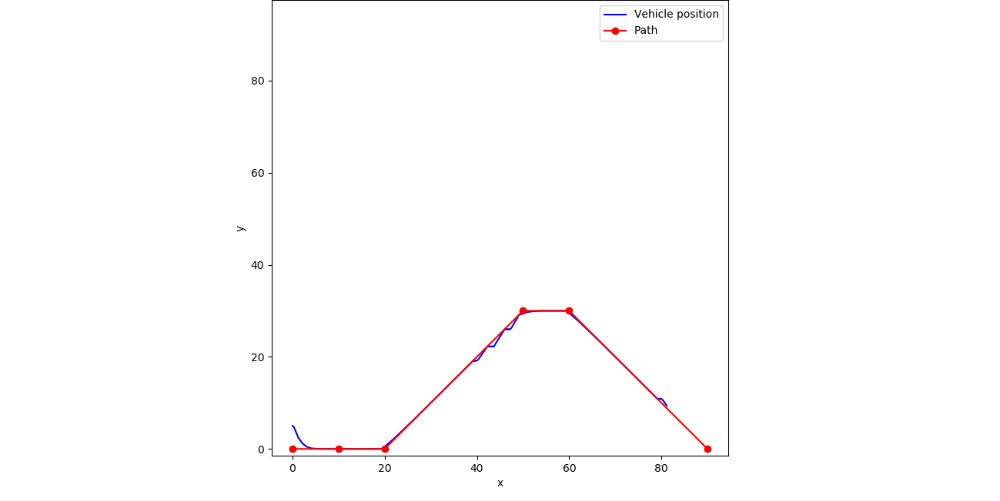

# Example 23: Follow The Carrot Path Tracking

## Contents

* [Overview](#overview) 
	* [Follow the carrot path tracking](#pure_pursuit_tracking)
* [Include files](#include_files)
* [Program structure](#prg_struct)
* [The main function](#m_func)
* [Results](#results)
* [Source Code](#source_code)

## <a name="overview"></a> Overview


### <a name="pure_pursuit_tracking"></a> Follow the carrot path tracking


## <a name="include_files"></a> Include files

```
#include "cubic_engine/base/cubic_engine_types.h"
#include "cubic_engine/control/carrot_chasing.h"
#include "cubic_engine/grids/waypoint_path.h"
#include "kernel/discretization/line_mesh.h"
#include "kernel/geometry/geom_point.h"
#include "kernel/dynamics/system_state.h"
#include "kernel/vehicles/difd_drive_vehicle.h"
#include "kernel/utilities/csv_file_writer.h"
#include "kernel/base/unit_converter.h"

#include <iostream>
```

## <a name="m_func"></a> The main function

```
namespace example{
using cengine::uint_t;
using cengine::real_t;
using cengine::control::CarrotChasingPathTrackController;
using cengine::grids::WaypointPath;
using cengine::grids::WayPoint;
using cengine::grids::LineSegment;
using cengine::grids::LineSegmentData;
using kernel::GeomPoint;
using kernel::dynamics::SysState;
using kernel::DiffDriveProperties;
using kernel::Null;

const real_t DT = 0.1;
const real_t GOAL_RADIUS = 1.0; // m

/// An agent to simulate
class Agent
{
public:

    /// Constructor
    Agent(CarrotChasingPathTrackController<Null, LineSegmentData>& path_ctrl_,
          const GeomPoint<2>& goal, real_t goal_r,
          const  DiffDriveProperties& properties);

    /// execute the agent that is go to goal
    void execute();

    /// returns trus  if the goal has been reached
    bool goal_reached()const;

    /// set the initial position
    void set_init_pos(real_t x, real_t y);

    /// set the initial velocity
    void set_init_velocities(real_t v, real_t w);

    /// set the initial heading
    void set_init_orientation(real_t theta);

private:

    /// the path track controller
    CarrotChasingPathTrackController<Null, LineSegmentData>* controller_ptr_;

    /// mobile platform of the agent
    kernel::DiffDriveVehicle platform_;

    /// the goal of the robot
    kernel::GeomPoint<2> goal_;

    /// the radius around the goal
    real_t g_radius_;

    /// save the results
    kernel::CSVWriter writer_;
};

Agent::Agent(CarrotChasingPathTrackController<Null, LineSegmentData>& path_ctrl,
             const GeomPoint<2>& goal,
             real_t goal_r, const  DiffDriveProperties& properties)
    :
    controller_ptr_(&path_ctrl),
    platform_(properties),
    goal_(goal),
    g_radius_(goal_r),
    writer_("agent_state.csv", ',', true)
{
    platform_.set_time_step(DT);
}

bool
Agent::goal_reached()const{

    GeomPoint<2> pos;
    platform_.get_position(pos);

    if(pos.distance(goal_)<=g_radius_){
        return true;
    }

    return false;
}

void
Agent::set_init_pos(real_t x, real_t y){
    platform_.set_x_position(x);
    platform_.set_y_position(y);
}

void
Agent::set_init_velocities(real_t v, real_t w){
    platform_.set_velocities(v, w);
}

void
Agent::set_init_orientation(real_t theta){
    platform_.set_orientation(theta);
}

void Agent::execute(){

    real_t time = 0.0;

    writer_.write_column_names({"X", "Y", "Theta"});

    auto v = 1.0;
    auto w = 0.0;

    std::vector<real_t> row(3);
    row[0] = platform_.get_x_position();
    row[1] = platform_.get_y_position();
    row[2] = platform_.get_orientation();
    writer_.write_row(row);

    uint_t counter = 0;
    while(!goal_reached() ){

        std::cout<<"At time: "<<time<<std::endl;
        std::cout<<"\n";

        auto x = platform_.get_x_position();
        auto y = platform_.get_y_position();
        auto theta = platform_.get_orientation();
        std::cout<<"Position: "<<x<<" , "<<y<<" theta (degs) "<<kernel::UnitConverter::rad_to_degrees(theta)<<std::endl;

        std::cout<<"Current V: "<<v<<std::endl;
        std::cout<<"Current W: "<<w<<std::endl;

        auto [control_result, lookahed_point, closest] = controller_ptr_->execute(platform_.get_state());
        w = control_result;

        platform_.integrate(v, w);

        row[0] = platform_.get_x_position();
        row[1] = platform_.get_y_position();
        row[2] = platform_.get_orientation();
        writer_.write_row(row);

        time += DT;
        counter++;
    }
}

}


int main(){

    using namespace example;

    try{
            WaypointPath<2, Null, LineSegmentData> path;
            path.reserve_n_waypoints(6);

            auto start = path.add_way_point(GeomPoint<2>({0.0, 0.0}), Null());
            path.add_way_point(GeomPoint<2>({10.0, 0.0}), Null());
            path.add_way_point(GeomPoint<2>({20.0, 0.0}), Null());
            path.add_way_point(GeomPoint<2>({50.0, 30.0}), Null());
            path.add_way_point(GeomPoint<2>({60.0, 30.0}), Null());
            auto goal = path.add_way_point(GeomPoint<2>({90.0, 0.0}), Null());

            LineSegmentData segmentdata = {1.0, 0.0, 0.0, 0.0};

            path.reserve_n_segments(5);
            path.add_segment(0, 1, segmentdata);
            path.add_segment(1, 2, segmentdata);

            segmentdata.theta = kernel::UnitConverter::degrees_to_rad(45.0);

            path.add_segment(2, 3, segmentdata);
            segmentdata.theta = 0.0;
            path.add_segment(3, 4, segmentdata);

            segmentdata.theta = kernel::UnitConverter::degrees_to_rad(-45.0);
            path.add_segment(4, 5, segmentdata);

            CarrotChasingPathTrackController<Null, LineSegmentData> controller;
            controller.set_lookahead_dist(7.5);
            controller.set_n_sampling_points(10);
            controller.set_gain(0.5);
            controller.set_wpoint_radius(1.5);

            controller.update(path);

            DiffDriveProperties properties;
            properties.R = 1.; //m
            properties.L = 0.5; //m
            properties.Vmax = 2.0; //m/sec
            properties.Amax = 1.2; // m/sec^2

            Agent agent(controller, goal, GOAL_RADIUS, properties);

            /// initialze the state of the agent at (0,0.5)
            agent.set_init_pos(0.0, 5.0);

            /// set the linear and angular velocities
            agent.set_init_velocities(1.0, 0.0);

            /// set the initial heading
            agent.set_init_orientation(0.0);

            agent.execute();

    }
    catch(std::exception& e){

        std::cerr<<e.what()<<std::endl;
    }
    catch(...){

        std::cerr<<"Unknown exception occured"<<std::endl;
    }

    return 0;
}
```

## <a name="results"></a> Results

```
...

Position: 87.9227 , 2.09307 theta (degs) -45.2166
Current V: 1
Current W: 3.52499e-06
At time: 233

Position: 87.9579 , 2.05758 theta (degs) -45.2166
Current V: 1
Current W: 3.40701e-06
At time: 233.1

Position: 87.9931 , 2.02209 theta (degs) -45.2166
Current V: 1
Current W: 3.29396e-06
At time: 233.2

Position: 88.0283 , 1.9866 theta (degs) -45.2165
Current V: 1
Current W: 3.18562e-06
At time: 233.3

Position: 88.0636 , 1.95112 theta (degs) -45.2165
Current V: 1
Current W: 3.08183e-06
At time: 233.4

Position: 88.0988 , 1.91563 theta (degs) -45.2165
Current V: 1
Current W: 2.98239e-06
At time: 233.5

Position: 88.134 , 1.88014 theta (degs) -45.2165
Current V: 1
Current W: 2.88714e-06
At time: 233.6

Position: 88.1692 , 1.84465 theta (degs) -45.2165
Current V: 1
Current W: 2.79592e-06
At time: 233.7

Position: 88.2044 , 1.80916 theta (degs) -45.2165
Current V: 1
Current W: 2.70857e-06
At time: 233.8

Position: 88.2397 , 1.77367 theta (degs) -45.2164
Current V: 1
Current W: 2.62494e-06
At time: 233.9

Position: 88.2749 , 1.73818 theta (degs) -45.2164
Current V: 1
Current W: 2.5449e-06
At time: 234

Position: 88.3101 , 1.7027 theta (degs) -45.2164
Current V: 1
Current W: 2.46832e-06
At time: 234.1

Position: 88.3453 , 1.66721 theta (degs) -45.2164
Current V: 1
Current W: 2.39506e-06
At time: 234.2

Position: 88.3805 , 1.63172 theta (degs) -45.2164
Current V: 1
Current W: 2.32502e-06
At time: 234.3

Position: 88.4158 , 1.59623 theta (degs) -45.2164
Current V: 1
Current W: 2.25807e-06
At time: 234.4

Position: 88.451 , 1.56074 theta (degs) -45.2164
Current V: 1
Current W: 2.19411e-06
At time: 234.5

Position: 88.4862 , 1.52525 theta (degs) -45.2164
Current V: 1
Current W: 2.13305e-06
At time: 234.6

Position: 88.5214 , 1.48976 theta (degs) -45.2163
Current V: 1
Current W: 2.07478e-06
At time: 234.7

Position: 88.5567 , 1.45428 theta (degs) -45.2163
Current V: 1
Current W: 2.01923e-06
At time: 234.8

Position: 88.5919 , 1.41879 theta (degs) -45.2163
Current V: 1
Current W: 1.96632e-06
At time: 234.9

Position: 88.6271 , 1.3833 theta (degs) -45.2163
Current V: 1
Current W: 1.91595e-06
At time: 235

Position: 88.6623 , 1.34781 theta (degs) -45.2163
Current V: 1
Current W: 1.86808e-06
At time: 235.1

Position: 88.6975 , 1.31232 theta (degs) -45.2163
Current V: 1
Current W: 1.82264e-06
At time: 235.2

Position: 88.7328 , 1.27683 theta (degs) -45.2163
Current V: 1
Current W: 1.77956e-06
At time: 235.3

Position: 88.768 , 1.24134 theta (degs) -45.2163
Current V: 1
Current W: 1.73881e-06
At time: 235.4

Position: 88.8032 , 1.20586 theta (degs) -45.2163
Current V: 1
Current W: 1.70034e-06
At time: 235.5

Position: 88.8384 , 1.17037 theta (degs) -45.2162
Current V: 1
Current W: 1.66411e-06
At time: 235.6

Position: 88.8736 , 1.13488 theta (degs) -45.2162
Current V: 1
Current W: 1.6301e-06
At time: 235.7

Position: 88.9089 , 1.09939 theta (degs) -45.2162
Current V: 1
Current W: 1.5983e-06
At time: 235.8

Position: 88.9441 , 1.0639 theta (degs) -45.2162
Current V: 1
Current W: 1.56869e-06
At time: 235.9

Position: 88.9793 , 1.02841 theta (degs) -45.2162
Current V: 1
Current W: 1.54127e-06
At time: 236

Position: 89.0145 , 0.992924 theta (degs) -45.2162
Current V: 1
Current W: 1.51607e-06
At time: 236.1

Position: 89.0498 , 0.957436 theta (degs) -45.2162
Current V: 1
Current W: 1.49309e-06
At time: 236.2

Position: 89.085 , 0.921947 theta (degs) -45.2162
Current V: 1
Current W: 1.47239e-06
At time: 236.3

Position: 89.1202 , 0.886459 theta (degs) -45.2162
Current V: 1
Current W: 1.45403e-06
At time: 236.4

Position: 89.1554 , 0.85097 theta (degs) -45.2162
Current V: 1
Current W: 1.43809e-06
At time: 236.5

Position: 89.1906 , 0.815482 theta (degs) -45.2162
Current V: 1
Current W: 1.42466e-06
At time: 236.6

Position: 89.2259 , 0.779993 theta (degs) -45.2162
Current V: 1
Current W: 1.41388e-06
At time: 236.7

Position: 89.2611 , 0.744505 theta (degs) -45.2161
Current V: 1
Current W: 1.40589e-06
```



## <a name="source_code"></a> Source Code

<a href="../exe.cpp">exc.cpp</a>

