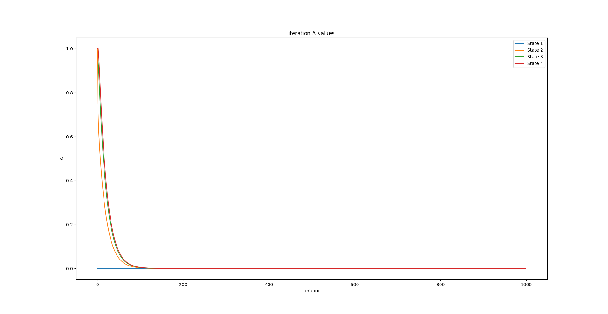

# Example: Solving the State-Value Function Problem

## Contents
* [Acknowledgements](#ackw)
* [Overview](#overview) 
	* [Basics of RL](#basics_rl)
	* [Dynamic Programming](#dynamic_programming)
	* [Monte Carlo](#monte_carlo)
	* [Temporal Difference](#temporal_difference)
* [Include files](#include_files)
* [Program structure](#prg_struct)
* [The main function](#m_func)
* [Results](#results)

##   Acknowledgements

This example is actually taken from <a href="https://towardsdatascience.com/reinforcement-learning-rl-101-with-python-e1aa0d37d43b">Towards Data Science</a>.
The code is primarily an adaptation of the Python code from <a href="https://towardsdatascience.com/reinforcement-learning-rl-101-with-python-e1aa0d37d43b"> here </a>.

##  Overview

###  Basics of RL

###  Dynamic Programming

###  Monte Carlo

###  Temporal Difference

##  Include files

##  Program structure

##  The main function

##  Results

