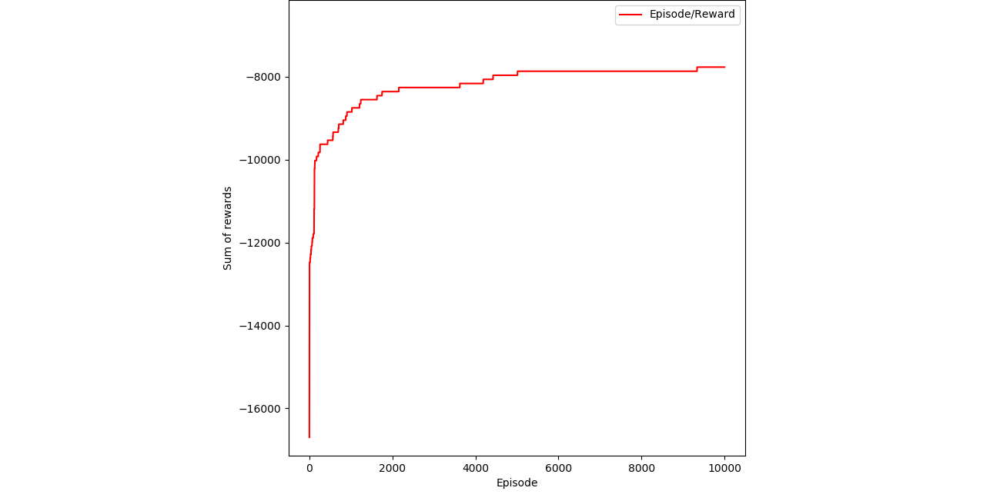

# Example 6: Qlearning applied on simple ```GridWorld```

## Contents
* [Acknowledgements](#ackw)
* [Overview](#overview) 
        * [Q-learning](#temporal_difference)
* [Include files](#include_files)
* [The main function](#m_func)
* [Results](#results)
* [Source Code](#source_code)

## <a name="ackw"></a>  Acknowledgements


## <a name="overview"></a> Overview


## <a name="include_files"></a> Include files

```
#include "cubic_engine/base/cubic_engine_types.h"
#include "kernel/utilities/csv_file_writer.h"
#include "kernel/base/kernel_consts.h"
#include "kernel/utilities/csv_file_writer.h"
#include "cubic_engine/rl/worlds/grid_world.h"
#include "cubic_engine/rl/worlds/grid_world_action_space.h"
#include "cubic_engine/rl/q_learning.h"
#include "cubic_engine/rl/reward_table.h"

#include <cmath>
#include <utility>
#include <tuple>
#include <iostream>
#include <random>
#include <algorithm>
```

## <a name="m_func"></a> The main function
```

namespace exe
{

using cengine::uint_t;
using cengine::real_t;
using cengine::rl::worlds::GridWorld;
using cengine::rl::worlds::GridWorldAction;
using cengine::rl::QTableLearning;
using cengine::rl::QLearningInput;
using cengine::rl::RewardTable;
using kernel::CSVWriter;
const uint_t N_CELLS = 7;
const real_t PENALTY = -100;


class RewardProducer
{
public:

    typedef real_t value_t;

    /// construcotr
    RewardProducer();

    /// returns the reward for the goal
    real_t goal_reward()const{return 0.0;}

    /// returns the reward for the action
    /// at  state s when going to state sprime
    template<typename ActionTp, typename StateTp>
    real_t get_reward(const ActionTp& action,
                      const StateTp& s,
                      const StateTp& sprime)const;

private:

    /// table that holds the rewards
    RewardTable<GridWorldAction, real_t> rewards_;

    /// setup the rewards
    void setup_rewards();
};

RewardProducer::RewardProducer()
    :
      rewards_()
{
    setup_rewards();
}

void
RewardProducer::setup_rewards(){

    for(uint_t i=0; i<N_CELLS*N_CELLS; ++i){

        if(i<7){

            if(i != 6 && i !=0 ){
                rewards_.add_reward(i, GridWorldAction::EAST,  PENALTY);
                rewards_.add_reward(i, GridWorldAction::NORTH,  -1.0);
                rewards_.add_reward(i, GridWorldAction::WEST,  PENALTY);
            }
            else{

               if(i == 0){
                   rewards_.add_reward(i, GridWorldAction::EAST,  PENALTY);
               }
               else{
                   rewards_.add_reward(i, GridWorldAction::WEST,  PENALTY);
               }

               rewards_.add_reward(i, GridWorldAction::NORTH,  PENALTY);
            }
        }
        else if(i>=42){

            if(i != 42 && i != 48 ){
                rewards_.add_reward(i, GridWorldAction::EAST,  PENALTY);

                if(i != 43){
                    rewards_.add_reward(i, GridWorldAction::SOUTH,  -1.0);
                }
                else{
                   rewards_.add_reward(i, GridWorldAction::SOUTH,  0.0);
                }

                rewards_.add_reward(i, GridWorldAction::WEST,  PENALTY);
            }
            else{
               rewards_.add_reward(i, GridWorldAction::SOUTH,  PENALTY);

               if( i == 42){
                    rewards_.add_reward(i, GridWorldAction::EAST,  PENALTY);
               }

               if(i == 48){
                   rewards_.add_reward(i, GridWorldAction::WEST,  PENALTY);
               }
            }


        }
        else{

            static const uint_t arwest[]={7,14,21,28, 35};
            static const uint_t areast[]={13,20,27,34, 41};

            if(std::find(&arwest[0],
                         &arwest[ sizeof(arwest)/sizeof(uint_t) ],
                         i) != &arwest[ sizeof (arwest)/sizeof(uint_t) ]){

                rewards_.add_reward(i, GridWorldAction::SOUTH,  PENALTY);
                rewards_.add_reward(i, GridWorldAction::NORTH,  PENALTY);

                if(i != 35){
                    rewards_.add_reward(i, GridWorldAction::EAST,  -1.0);
                }
                else{
                   rewards_.add_reward(i, GridWorldAction::EAST,  0.0);
                }
            }
            else if(std::find(&areast[0],
                              &areast[ sizeof(areast)/sizeof(uint_t) ],
                              i) != &areast[ sizeof (areast)/sizeof(uint_t) ]){

                rewards_.add_reward(i, GridWorldAction::SOUTH,  PENALTY);
                rewards_.add_reward(i, GridWorldAction::NORTH,  PENALTY);

                if(i != 13){
                    rewards_.add_reward(i, GridWorldAction::WEST,  -1.0);
                }
                else{
                   rewards_.add_reward(i, GridWorldAction::WEST,  0.0);
                }
            }
            else{

                static uint_t short_path_1[] ={8, 15, 22, 29, 36};
                static uint_t short_path_2[] ={37, 38, 39, 40};
                static uint_t short_path_3[] ={33, 26, 13, 12};
                static uint_t short_path_4[] ={9, 10, 11};

                if(std::find(&short_path_1[0],
                             &short_path_1[ sizeof(short_path_1)/sizeof(uint_t) ],
                                         i) != &short_path_1[ sizeof (short_path_1)/sizeof(uint_t) ]){


                     if(i != 36){
                         rewards_.add_reward(i, GridWorldAction::NORTH,  -2.0);
                         rewards_.add_reward(i, GridWorldAction::WEST,  PENALTY);

                         if(i != 8){
                             rewards_.add_reward(i, GridWorldAction::EAST,  -3.);
                             rewards_.add_reward(i, GridWorldAction::SOUTH,  -1.0);
                         }
                         else{
                             rewards_.add_reward(i, GridWorldAction::EAST,  -1.0);
                             rewards_.add_reward(i, GridWorldAction::SOUTH,  PENALTY);
                         }
                     }
                     else{
                        rewards_.add_reward(i, GridWorldAction::NORTH,  PENALTY);
                        rewards_.add_reward(i, GridWorldAction::WEST,  PENALTY);
                        rewards_.add_reward(i, GridWorldAction::EAST,  -1.0);
                        rewards_.add_reward(i, GridWorldAction::SOUTH,  -1.0);
                     }
                }
                else if(std::find(&short_path_2[0],
                                  &short_path_2[ sizeof(short_path_2)/sizeof(uint_t) ],
                                              i) != &short_path_2[ sizeof (short_path_2)/sizeof(uint_t) ]){


                    rewards_.add_reward(i, GridWorldAction::NORTH,  PENALTY);

                    if(i != 40){
                        rewards_.add_reward(i, GridWorldAction::SOUTH,  -3.0);
                        rewards_.add_reward(i, GridWorldAction::EAST,  -1.0);
                        rewards_.add_reward(i, GridWorldAction::WEST,  -2.0);
                    }
                    else{
                        rewards_.add_reward(i, GridWorldAction::SOUTH,  -1.0);
                        rewards_.add_reward(i, GridWorldAction::EAST,  PENALTY);
                        rewards_.add_reward(i, GridWorldAction::WEST,  -2.0);
                    }

                }
                else if(std::find(&short_path_3[0],
                                  &short_path_3[ sizeof(short_path_3)/sizeof(uint_t) ],
                                              i) != &short_path_3[ sizeof (short_path_3)/sizeof(uint_t) ]){


                    rewards_.add_reward(i, GridWorldAction::NORTH,  -2.0);
                    rewards_.add_reward(i, GridWorldAction::EAST,  PENALTY);

                    if(i != 12){
                        rewards_.add_reward(i, GridWorldAction::SOUTH,  -1.0);
                        rewards_.add_reward(i, GridWorldAction::WEST,  -3.0);
                    }
                    else{
                        rewards_.add_reward(i, GridWorldAction::SOUTH,  PENALTY);
                        rewards_.add_reward(i, GridWorldAction::WEST,  -2.0);
                    }
                }
                else if(std::find(&short_path_4[0],
                                  &short_path_4[ sizeof(short_path_4)/sizeof(uint_t) ],
                                              i) != &short_path_4[ sizeof (short_path_4)/sizeof(uint_t) ]){

                    rewards_.add_reward(i, GridWorldAction::NORTH,  -3.);
                    rewards_.add_reward(i, GridWorldAction::SOUTH,  PENALTY);
                    rewards_.add_reward(i, GridWorldAction::WEST,  -2.0);

                    if(i==11){
                       rewards_.add_reward(i, GridWorldAction::EAST,  0.);
                    }
                    else{
                        rewards_.add_reward(i, GridWorldAction::EAST,  -1.);
                    }
                }
                else{

                    if(i == 30 || i == 31 || i == 32){

                        rewards_.add_reward(i, GridWorldAction::NORTH,  -1.0);
                        rewards_.add_reward(i, GridWorldAction::SOUTH,  -3.0);

                        if(i == 32){
                            rewards_.add_reward(i, GridWorldAction::EAST,  -1.0);
                        }
                        else{
                            rewards_.add_reward(i, GridWorldAction::EAST,  -3.0);
                        }

                        if(i == 30){
                            rewards_.add_reward(i, GridWorldAction::WEST,  -1.0);
                        }
                        else{
                            rewards_.add_reward(i, GridWorldAction::WEST,  -3.0);
                        }
                    }
                    else if (i == 23 || i == 24 || i == 25) {

                        rewards_.add_reward(i, GridWorldAction::NORTH,  -3.0);
                        rewards_.add_reward(i, GridWorldAction::SOUTH,  -3.0);

                        if(i == 25){
                            rewards_.add_reward(i, GridWorldAction::EAST,  -1.0);
                        }
                        else{
                            rewards_.add_reward(i, GridWorldAction::EAST,  -3.0);
                        }

                        if(i == 23){
                            rewards_.add_reward(i, GridWorldAction::WEST,  -1.0);
                        }
                        else{
                            rewards_.add_reward(i, GridWorldAction::WEST,  -3.0);
                        }
                    }
                    else{
                        rewards_.add_reward(i, GridWorldAction::NORTH,  -3.0);
                        rewards_.add_reward(i, GridWorldAction::SOUTH,  -1.0);

                        if(i == 18){
                            rewards_.add_reward(i, GridWorldAction::EAST,  -1.0);
                        }
                        else{
                            rewards_.add_reward(i, GridWorldAction::EAST,  -3.0);
                        }

                        if(i == 16){
                            rewards_.add_reward(i, GridWorldAction::WEST,  -1.0);
                        }
                        else{
                            rewards_.add_reward(i, GridWorldAction::WEST,  -3.0);
                        }
                    }
                }
            }
        }

    }
}

template<typename ActionTp, typename StateTp>
real_t
RewardProducer::get_reward(const ActionTp& action,
                           const StateTp& s,
                           const StateTp& sprime)const{

    return rewards_.get_reward(s.get_id(), action);

}

typedef GridWorld<RewardProducer> world_t;
typedef world_t::state_t state_t;

void
create_wolrd(world_t& w){

   std::vector<state_t> world_states;
   world_states.reserve(N_CELLS*N_CELLS);

   uint_t counter=0;
   for(uint_t i=0; i<N_CELLS; ++i){
       for(uint_t j=0; j<N_CELLS; ++j){
           world_states.push_back(state_t(counter++));
       }
   }

   w.set_states(std::move(world_states));

   counter=0;
   for(uint_t i=0; i<N_CELLS*N_CELLS; ++i){

       auto& state = w.get_state(i);

       /// bottom row
       if(i <7){

           state.set_transition(static_cast<GridWorldAction>(GridWorldAction::SOUTH), nullptr);

           if(i != 6){
             state.set_transition(GridWorldAction::EAST, &w.get_state(i+1));
           }
           else{
               state.set_transition(GridWorldAction::EAST, nullptr);
           }

           state.set_transition(GridWorldAction::NORTH, &w.get_state(N_CELLS + i));

           if(i == 0){
                state.set_transition(static_cast<GridWorldAction>(GridWorldAction::WEST), nullptr);
           }
           else{
               state.set_transition(static_cast<GridWorldAction>(GridWorldAction::WEST), &w.get_state(i-1));
           }
       }
       else if(i >= 42 ){
           /// top row

           state.set_transition(static_cast<GridWorldAction>(GridWorldAction::SOUTH), &w.get_state(i - N_CELLS));

           if(i != 48){
             state.set_transition(GridWorldAction::EAST, &w.get_state(i+1));
           }
           else{
               state.set_transition(GridWorldAction::EAST, nullptr);
           }

           state.set_transition(GridWorldAction::NORTH, nullptr);

           if(i == 42){
               state.set_transition(static_cast<GridWorldAction>(GridWorldAction::WEST), nullptr);
           }
           else{
              state.set_transition(static_cast<GridWorldAction>(GridWorldAction::WEST), &w.get_state(i-1));
           }
       }
       else{

           /// all rows in between
           state.set_transition(static_cast<GridWorldAction>(GridWorldAction::SOUTH), &w.get_state(i - N_CELLS));

           if(i != 13 && i != 20 && i != 27 && i != 41 && i != 34){
               state.set_transition(static_cast<GridWorldAction>(GridWorldAction::EAST), &w.get_state(i +1));
           }
           else{
               state.set_transition(static_cast<GridWorldAction>(GridWorldAction::EAST), nullptr);
           }

           state.set_transition(static_cast<GridWorldAction>(GridWorldAction::NORTH), &w.get_state(i + N_CELLS));

           if(i != 7 && i != 14 && i != 21 && i != 28 && i != 35){
              state.set_transition(static_cast<GridWorldAction>(GridWorldAction::WEST), &w.get_state(i-1));
           }
           else {
              state.set_transition(static_cast<GridWorldAction>(GridWorldAction::WEST), nullptr);
           }
       }
   }
}

}

int main() {

    using namespace exe;

    /// the world of the agent
    world_t world;

    create_wolrd(world);

    std::cout<<"Number of states: "<<world.n_states()<<std::endl;

    state_t start(36);
    state_t goal(12);

    /// simulation parameters
    const real_t EPSILON = 0.1;

    QLearningInput qinput={1.0, EPSILON, 0.0, true, true};
    QTableLearning<world_t> qlearner(std::move(qinput));

    CSVWriter writer("agent_rewards.csv", ',', true);

    writer.write_column_names({"Episode", "Reward"}, true);

    /// number of episodes for the agent to
    /// learn the Q-values.
    const uint_t N_ITERATIONS = 10000;

    std::vector<real_t> row(2);
    qlearner.initialize(world, PENALTY);

    for(uint_t episode=0; episode < N_ITERATIONS; ++episode){
        world.restart(start, goal);
        qlearner.train(goal);

        auto reward = qlearner.get_table().get_total_reward();
        writer.write_row(std::make_tuple(episode, reward));
        std::cout<<"At episode: "<<episode<<" total reward: "<<reward<<std::endl;
    }

    /// now that we train let's play
    auto& qtable = qlearner.get_table();

    auto stop = false;

    world.restart(start, goal);

    auto counter = 0;
    while(!stop){

        auto& state = world.get_current_state();
        std::cout<<"At state: "<<state.get_id()<<std::endl;

        if(state == goal){
            std::cout<<"State: "<<state.get_id()<<" is the goal"<<std::endl;
            break;
        }

        /// get the action with the maximum value
        auto action = qtable.get_max_reward_action_at_state(state.get_id());

        std::cout<<"Maximum reward action: "<<cengine::rl::worlds::to_string(action)<<std::endl;
        std::cout<<"MAximum reward is: "<<qtable.get_max_reward_at_state(state.get_id())<<std::endl;
        world.execute_action(action);
        counter++;
    }
    
   return 0;
}

```

## <a name="results"></a> Results

```
...
At episode: 9997 total reward: -7767
At iteration: 1
	Current state: 36
	 Setting for state: 36 and action: SOUTH to value: -1
At iteration: 2
	Current state: 29
	 Setting for state: 29 and action: SOUTH to value: -1
At iteration: 3
	Current state: 22
	 Setting for state: 22 and action: SOUTH to value: -1
At iteration: 4
	Current state: 15
	 Setting for state: 15 and action: NORTH to value: -2
At iteration: 5
	Current state: 22
	 Setting for state: 22 and action: SOUTH to value: -1
At iteration: 6
	Current state: 15
	 Setting for state: 15 and action: SOUTH to value: -1
At iteration: 7
	Current state: 8
	 Setting for state: 8 and action: EAST to value: -1
At iteration: 8
	Current state: 9
	 Setting for state: 9 and action: NORTH to value: -3
At iteration: 9
	Current state: 16
	 Setting for state: 16 and action: SOUTH to value: -1
At iteration: 10
	Current state: 9
	 Setting for state: 9 and action: EAST to value: -1
At iteration: 11
	Current state: 10
	 Setting for state: 10 and action: EAST to value: -1
At iteration: 12
	Current state: 11
	 Setting for state: 11 and action: EAST to value: 0
At episode: 9998 total reward: -7767
At iteration: 1
	Current state: 36
	 Setting for state: 36 and action: SOUTH to value: -1
At iteration: 2
	Current state: 29
	 Setting for state: 29 and action: SOUTH to value: -1
At iteration: 3
	Current state: 22
	 Setting for state: 22 and action: SOUTH to value: -1
At iteration: 4
	Current state: 15
	 Setting for state: 15 and action: SOUTH to value: -1
At iteration: 5
	Current state: 8
	 Setting for state: 8 and action: EAST to value: -1
At iteration: 6
	Current state: 9
	 Setting for state: 9 and action: EAST to value: -1
At iteration: 7
	Current state: 10
	 Setting for state: 10 and action: EAST to value: -1
At iteration: 8
	Current state: 11
	 Setting for state: 11 and action: EAST to value: 0
At episode: 9999 total reward: -7767
At state: 36
Maximum reward action: SOUTH
MAximum reward is: -1
At state: 29
Maximum reward action: SOUTH
MAximum reward is: -1
At state: 22
Maximum reward action: SOUTH
MAximum reward is: -1
At state: 15
Maximum reward action: SOUTH
MAximum reward is: -1
At state: 8
Maximum reward action: EAST
MAximum reward is: -1
At state: 9
Maximum reward action: EAST
MAximum reward is: -1
At state: 10
Maximum reward action: EAST
MAximum reward is: -1
At state: 11
Maximum reward action: EAST
MAximum reward is: 0
At state: 12
State: 12 is the goal
```



## <a name="source_code"></a> Source Code

<a href="../exe.cpp">exc.cpp</a>


