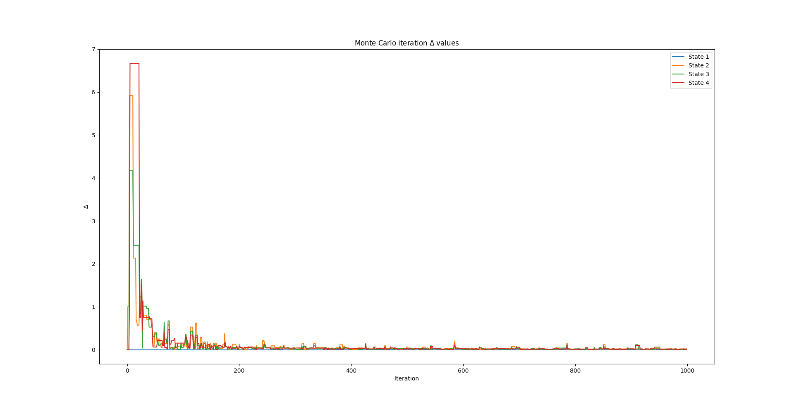

# Example 6: Temporal Difference Learning

## Contents
* [Acknowledgements](#ackw)
* [Overview](#overview) 
	* [Temporal Difference](#temporal_difference)
* [Include files](#include_files)
* [Program structure](#prg_struct)
* [The main function](#m_func)
* [Results](#results)

## <a name="ackw"></a>  Acknowledgements

This example is actually taken from <a href="https://towardsdatascience.com/reinforcement-learning-rl-101-with-python-e1aa0d37d43b">Towards Data Science</a>.
The code is primarily an adaptation of the Python code from <a href="https://towardsdatascience.com/reinforcement-learning-rl-101-with-python-e1aa0d37d43b"> here </a>.

## <a name="overview"></a> Overview

### <a name="sarsa_algorithm"></a> SARSA Algorithm
SARSA stands for State-Action-Reward-State-Action and it is an iterative algorithm
for  learning a <a href="https://en.wikipedia.org/wiki/Markov_decision_process">Markov Decision Process</a>.

As the name implies, the algorithm uses the current agent state say ```S_1```,
the action the agent chooses ```A_1```, the reward ```R``` that the agent
gets for choosing this action, the state ```S_2``` that the agent enters after
taking action ```A_1``` and the next action ```A_2``` the agent chooses when in
state ```S_2```.

Hence, the update of the ```Q``` function is given by the equation below


The algorithm is described below


### <a name="dynamic_programming"></a> Dynamic Programming

### <a name="monte_carlo"></a> Monte Carlo

### <a name="temporal_difference"></a> Temporal Difference

## <a name="include_files"></a> Include files

## <a name="prg_struct"></a> Program structure

## <a name="m_func"></a> The main function

## <a name="results"></a> Results





