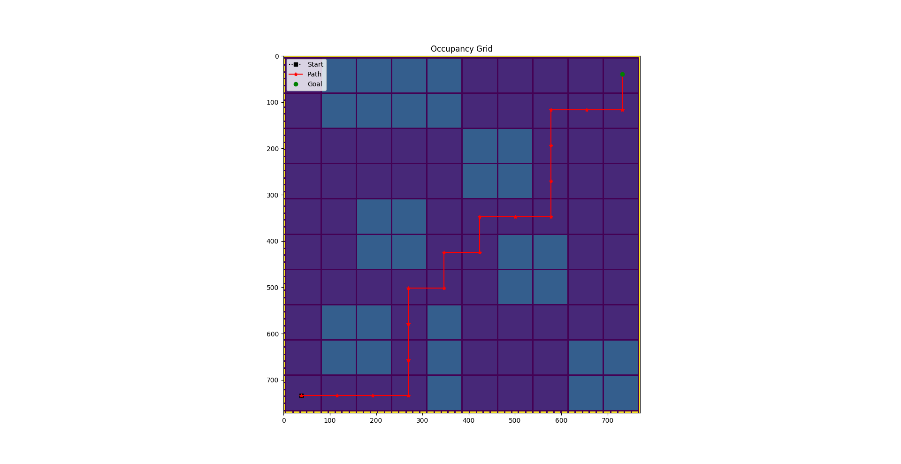

# Example 9:  A* Path finding

## Contents
* [Overview](#overview) 
* [Include files](#include_files)
* [The main function](#m_func)
* [Results](#results)
* [Source Code](#source_code)

## <a name="overview"></a> Overview


## <a name="include_files"></a> Include files

```
#include "cubic_engine/base/cubic_engine_types.h"
#include "cubic_engine/search/a_star_search.h"

#include "kernel/data_structs/serial_graph_builder.h"
#include "kernel/utilities/vtk_mesh_file_writer.h"
#include "kernel/maths/lp_metric.h"
#include "kernel/data_structs/boost_graph_utils.h"

#include "kernel/utilities/csv_file_writer.h"
#include "kernel/discretization/mesh.h"
#include "kernel/discretization/element_mesh_iterator.h"
#include "kernel/discretization/mesh_predicates.h"
#include "kernel/discretization/element.h"
#include "kernel/discretization/mesh_generation.h"
#include "kernel/discretization/quad_mesh_generation.h"
```

## <a name="m_func"></a> The main function

```
namespace example{

using cengine::real_t;
using cengine::uint_t;

using kernel::GeomPoint;
using kernel::numerics::Mesh;
using kernel::numerics::LineMesh;
using kernel::BoostSerialGraph;
using kernel::Null;


//vertex data to apply A*
struct AstarNodeData
{
    real_t gcost;
    real_t fcost;
    real_t occumancy_prob;

    GeomPoint<2> position;

    AstarNodeData();
    AstarNodeData(const GeomPoint<2>& p);
    AstarNodeData(const AstarNodeData& o);

    bool can_move()const{return occumancy_prob != 1.0;}

};

AstarNodeData::AstarNodeData()
:
gcost(std::numeric_limits<real_t>::max()),
fcost(std::numeric_limits<real_t>::max()),
position()
{}

AstarNodeData::AstarNodeData(const GeomPoint<2>& p)
:
gcost(std::numeric_limits<real_t>::max()),
fcost(std::numeric_limits<real_t>::max()),
position(p)
{}

AstarNodeData::AstarNodeData(const AstarNodeData& o)
:
gcost(o.gcost),
fcost(o.fcost),
position(o.position)
{}

typedef BoostSerialGraph<AstarNodeData, Null> Map;
typedef LineMesh<2> Path;
typedef GeomPoint<2> Goal;


// Given the state produced by the
// StateEstimationThread produce a Path
// to be followed
struct PathConstructor
{
public:

    // constructor
    PathConstructor(const Map& map);

    // run the thread
    void run();

protected:

    // the map used
    const Map* map_;

    // the path constructed
    Path path_;

    // save the computed path
    void save_path(real_t duration);

};

inline
PathConstructor::PathConstructor(const Map& map)
    :
    map_(&map),
    path_()
{}

void
PathConstructor::save_path(real_t duration){

    std::string dur = std::to_string(duration);

    std::vector<std::string> strings;
    std::istringstream f(dur);
    std::string s;
    while (std::getline(f, s, '.')) {
        strings.push_back(s);
    }


    kernel::CSVWriter writer("path_" + strings[1]+ ".csv", ',', true);
    writer.write_mesh(path_);

}

void
PathConstructor::run(){

    std::chrono::time_point<std::chrono::system_clock> start;
    std::chrono::time_point<std::chrono::system_clock> end;
    start = std::chrono::system_clock::now();

    // both are updated so try to establish the path
    // path should be publiched every ???
    typedef Map::vertex_type vertex_t;
    std::vector<real_t> pos(2);
    kernel::LpMetric<2> h;
    Goal goal(1.0);
    Goal position(0.0);

    static auto closest_start_vertex_pred = [&](const vertex_t& vertex){

        auto distance = vertex.data.position.distance(position);

        if( distance < 0.1){
            return true;
        }

        return false;
    };

    static auto closest_goal_vertex_pred = [&](const vertex_t& vertex){

        auto distance = vertex.data.position.distance(goal);

        if( distance < 0.1){
            return true;
        }

        return false;
    };

    // we need to find the starting node with the position
    // closest to the robot position
    uint_t start_vertex_id = kernel::find_vertex(*map_, closest_start_vertex_pred);
    uint_t goal_vertex_id = kernel::find_vertex(*map_, closest_goal_vertex_pred);

    // if this is an invalid id then throw?
    if(start_vertex_id == kernel::KernelConsts::invalid_size_type() ||
        goal_vertex_id == kernel::KernelConsts::invalid_size_type()    ){
        throw std::logic_error("Invalid vertex id for path finding");
    }

    vertex_t start_pos;
    start_pos.data.position = position;
    start_pos.id = start_vertex_id;

    vertex_t goal_pos;
    goal_pos.data.position = goal;
    goal_pos.id = goal_vertex_id;

    // find the path we need the goal
    auto path_connections = cengine::astar_search(const_cast<Map&>(*map_), start_pos, goal_pos, h );

    if(path_connections.empty()){
       throw std::logic_error("Path connections are empty");
    }

    // update the line mesh that represents the path
    std::vector<uint_t> mesh_data = cengine::reconstruct_a_star_path(path_connections, goal_vertex_id);

    // now that we have the connections let's update the path
    kernel::numerics::build_mesh(path_, *map_, mesh_data);

    end = std::chrono::system_clock::now();
    std::chrono::duration<real_t> duration = end - start;
    // save the path
    save_path(duration.count());
}

}


int main(){

#ifdef USE_LOG
    kernel::Logger::set_log_file_name("/home/david/CubicEngineering/cubic_engine_develop_branches/integrate_diff_drive_model/cubic_engine/build/examples/exe9/log_file.log");
#endif

    using namespace example;

    // create the graph from the mesh
    Map map;

    {
        uint_t nx = 10;
        uint_t ny = 10;

        GeomPoint<2> start(0.0);
        GeomPoint<2> end(1.0);

        Mesh<2> mesh;

        // generate the mesh
        kernel::numerics::build_quad_mesh(mesh, nx, ny, start, end);

        kernel::numerics::VtkMeshFileWriter writer("map.vtk", true);
        std::vector<real_t> occupamcy_prob(mesh.n_elements(), 0.0);

        occupamcy_prob[4] = 1.0;
        occupamcy_prob[8] = 1.0;
        occupamcy_prob[9] = 1.0;
        occupamcy_prob[18] = 1.0;
        occupamcy_prob[19] = 1.0;
        occupamcy_prob[14] = 1.0;
        occupamcy_prob[24] = 1.0;
        occupamcy_prob[11] = 1.0;
        occupamcy_prob[12] = 1.0;
        occupamcy_prob[21] = 1.0;
        occupamcy_prob[22] = 1.0;

        occupamcy_prob[42] = 1.0;
        occupamcy_prob[43] = 1.0;
        occupamcy_prob[52] = 1.0;
        occupamcy_prob[53] = 1.0;

        occupamcy_prob[36] = 1.0;
        occupamcy_prob[37] = 1.0;
        occupamcy_prob[46] = 1.0;
        occupamcy_prob[47] = 1.0;

        occupamcy_prob[65] = 1.0;
        occupamcy_prob[66] = 1.0;
        occupamcy_prob[75] = 1.0;
        occupamcy_prob[76] = 1.0;

        occupamcy_prob[91] = 1.0;
        occupamcy_prob[92] = 1.0;
        occupamcy_prob[93] = 1.0;
        occupamcy_prob[94] = 1.0;

        occupamcy_prob[81] = 1.0;
        occupamcy_prob[82] = 1.0;
        occupamcy_prob[83] = 1.0;
        occupamcy_prob[84] = 1.0;

        // write the occupancy grid
        writer.write_mesh(mesh, occupamcy_prob, "OccupancyProb");

        // build the mesh graph
        kernel::build_mesh_graph(mesh, map);

        for(uint_t v=0; v<map.n_vertices(); ++v){
           auto& vertex = map.get_vertex(v);
           uint_t id = vertex.id;
           auto* element = mesh.element(id);
           vertex.data.position = element->centroid();
           vertex.data.occumancy_prob = occupamcy_prob[id];
        }

    }

   PathConstructor constructor(map);
   constructor.run();
   return 0;
}
```

## <a name="results"></a> Results



## <a name="source_code"></a> Source Code

<a href="../exe.cpp">exe.cpp</a>
